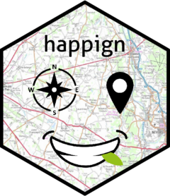

<!-- README.md is generated from README.Rmd. Please edit that file -->

# happign <a href="https://paul-carteron.github.io/happign/"></a>

# happign - IGN API for R

<!-- badges: start -->

[](https://github.com/paul-carteron/happign/actions/workflows/R-CMD-check.yaml)
[](https://CRAN.R-project.org/package=happign)
[](https://cran.r-project.org/package=happign)
[](https://app.codecov.io/gh/paul-carteron/happign?branch=main)
[](https://lifecycle.r-lib.org/articles/stages.html#experimental)
<!-- badges: end -->

The goal of happign is to facilitate the use of Web Services and API
from the IGN (French National Institute of Geographic and Forestry
Information). `happign` allow downloading of :

-   Shapefile via use of WFS service and APIcarto
-   Raster via use of WMS raster service

### Context

Since January 1, 2021, the French National Institute for Geographic and
Forestry Information (IGN) has made its public data on French
topography, infrastructure, and terrain freely available. The opening of
IGN data under the Etalab 2.0 open license means free access and use for
all.

To facilitate access to this data, IGN has implemented a set of APIs and
Web services based on OGC standards. In spite of a well supplied
documentation, the use of APIs and Web services remains complex to set
up in R. The `happign` package has been created to facilitate this.

### Rights of use for IGN data

Data from [IGN geoservice
website](https://geoservices.ign.fr/presentation) are free and available
in open license according to the principle of the [Etalab 2.0
license](https://www.etalab.gouv.fr/licence-ouverte-open-licence/) since
January 1, 2021. Other data complete the IGN’s open data policy since
June 1st, 2021. SCAN 25®, SCAN 100® and SCAN OACI data are free to
download or stream, but any professional or individual wishing to
develop a commercial paper or digital offer for the general public will
have to pay a fee according to the [General Conditions of
Use](https://geoservices.ign.fr/cgu-licences).

### Installation

You can install the released version of happign from
[CRAN](https://CRAN.R-project.org) with:

``` r
install.packages("happign")
```

And the development version from [GitHub](https://github.com/) with:

``` r
# install.packages("devtools")
devtools::install_github("paul-carteron/happign")
```

### Vignettes

Package vignettes :

-   [Getting started with
    happign](https://paul-carteron.github.io/happign/articles/Getting_started.html)
    : A brief intro to happign world ;
-   [happign for
    foresters](https://paul-carteron.github.io/happign/articles/web_only/happign_for_foresters.html)
    : happign can be used in many ways but here I focus on forestry.
-   [SCAN 25, SCAN 100 et SCAN
    OACI](https://paul-carteron.github.io/happign/articles/SCAN_25_SCAN_100_SCAN_OACI.html)
    : How to download the only Scan 25, Scan 100 and Scan OACI
-   [Resolution for
    raster](https://paul-carteron.github.io/happign/articles/web_only/resolution_for_raster.html)
    : IGN tiles are limited to 2064x2064 pixel. `happign` happign allows
    you to get around this limitation. The process is explained in this
    vignette.

### Future features

IGN offers other services. Their implementation in R is under
development :

-   Implement all REST API Carto compatible with the OpenAPI
    specification (easy and quick downloading for WFS)
-   Implement isochrone and isodistance calculation

### Problems and Issues

-   Please report any issues or bugs you may encounter on the [dedicated
    page on github](https://github.com/paul-carteron/happign/issues).

### System Requirements

`happign` requires [`R`](https://cran.r-project.org) v \>= 4.1.0.

### Why it’s called `happign` ?

This project is - obviously - called happign; here’s why :

-   “ign” stand for… IGN : the acronym of the institute ;
-   “api” stand for… API : one of the interface used to retrieve the
    data;
-   and the addition of an “h” and another “p” for the pun with “happy”.
    Besides the fact that I love this kind of humor, the simplified use
    of APIs is a real source of happiness, trust me.

Also, for the most attentive to details, you can see on the logo a green
leaf stuck between the teeth of the charming smile. It is none other
than the leaf from the IGN logo.

### Code of Conduct

Please note that the happign project is released with a [Contributor
Code of
Conduct](https://paul-carteron.github.io/happign/CODE_OF_CONDUCT.html).
By contributing to this project, you agree to abide by its terms.
