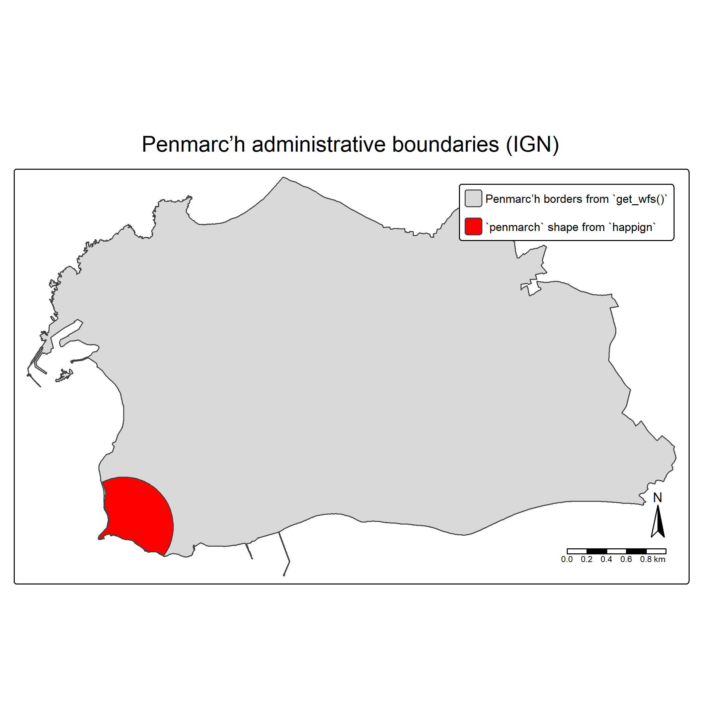
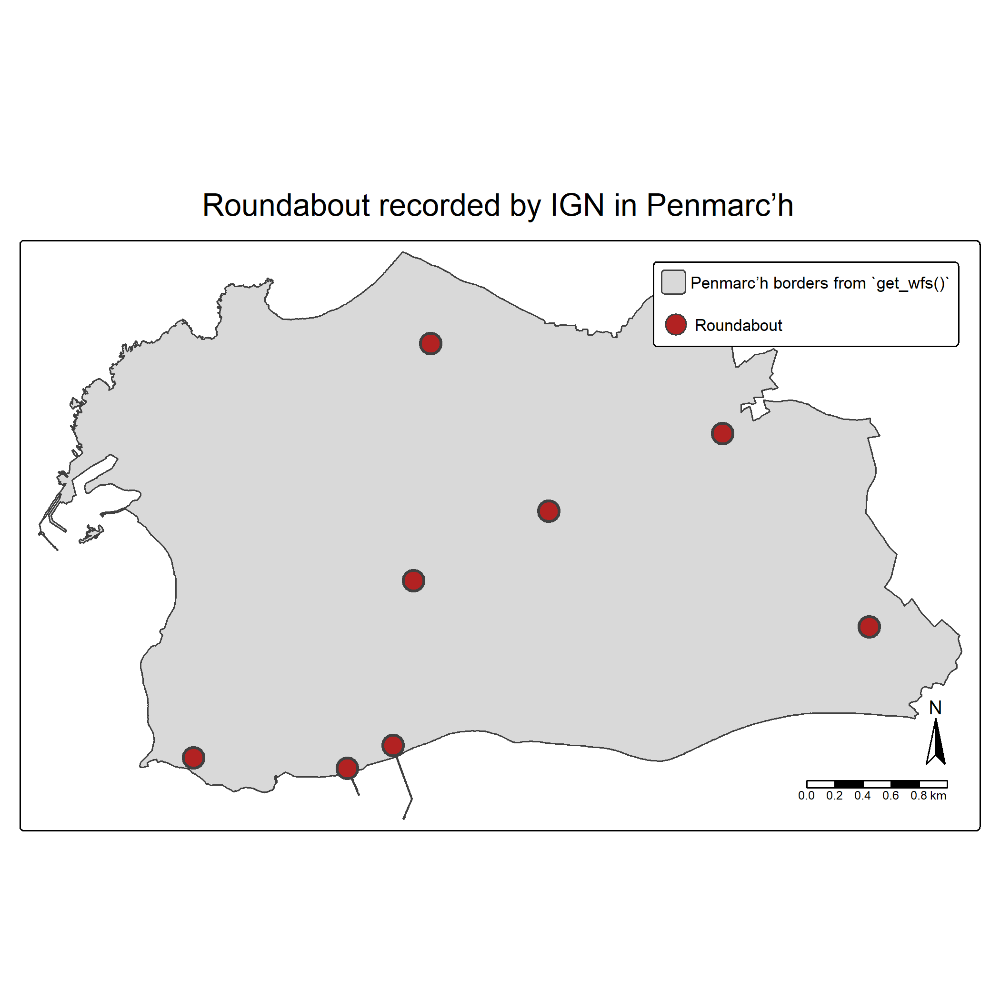
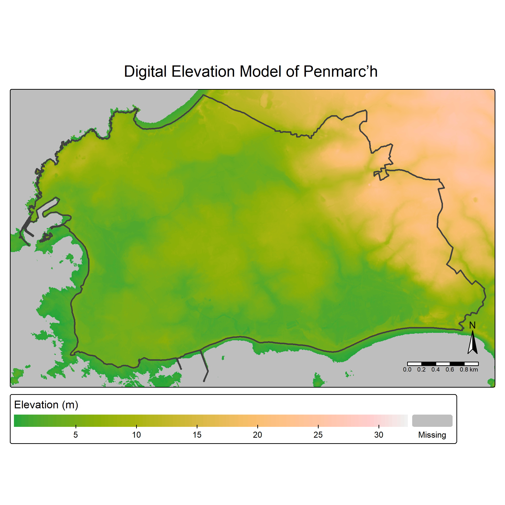

# Getting started

## Before starting

We can load the `happign` package, and some additional packages we will
need (`sf` to manipulate spatial data and `tmap` to create maps)

``` r
library(happign)
library(sf)
library(tmap)
```

### WFS, WMS, and WMTS services

`happign` provides access to three web services published by **IGN**
(Institut national de l’information géographique et forestière):

- **WFS (Web Feature Service)**: Vector data (points, lines, polygons)

- **WMS (Web Map Service)**: Raster images generated on the fly

- **WMTS (Web Map Tile Service)**: Raster map images served as
  pre-generated tiles, optimized for fast display.

The official OGC specifications for these services are available online:

- WFS: <https://www.ogc.org/standards/wfs/>

- WMS: <https://www.ogc.org/standards/wms/>

- WMTS: <https://www.ogc.org/standards/wmts/>

### How to download data with `happign`

To retrieve data using `happign`, two pieces of information are
required:

1.  **What to download**: The name of the layer exposed by the IGN
    service (acces with
    [`get_layers_metadata()`](https://paul-carteron.github.io/happign/reference/get_layers_metadata.md))

2.  **Where to download it**: An *area of interest*, provided as an `sf`
    geometry (from the [`{sf}`](https://CRAN.R-project.org/package=sf)
    package).

`happign` then takes care of building the web service requests and
returns data usable in R.

### Layer names

Layer names can be obtained directly from the IGN website. For example,
in the **WFS** service, the first layer listed in the [*Administratif*
category](https://geoservices.ign.fr/services-web-experts-administratif)
is: `"ADMINEXPRESS-COG-CARTO.LATEST:arrondissement"`

To avoid copying layer names manually, `happign` provides the
[`get_layers_metadata()`](https://paul-carteron.github.io/happign/reference/get_layers_metadata.md)
function, which queries the IGN services directly and always returns the
most up-to-date list of available layers.

This function can be used with **WFS**, **WMS**, and **WMTS** services:

``` r
wfs_layers <- get_layers_metadata(data_type = "wfs")
wms_layers <- get_layers_metadata(data_type = "wms-r")
wmts_layers <- get_layers_metadata(data_type = "wmts")
```

The returned object contains metadata for each available layer,
including name, title, and service-specific information.

### Downloading data

After selecting layer name, downloading data with `happign` only
requires a few lines of code.

In the following example, we focus on the town of **Penmarc’h**
(France). A polygon representing part of this municipality is included
in `happign` and will be used as the area of interest.

``` r
penmarch <- sf::read_sf(system.file("extdata/penmarch.shp", package = "happign"))
```

#### WFS ; vector data

The
[`get_wfs()`](https://paul-carteron.github.io/happign/reference/get_wfs.md)
function is used to download vector data from IGN WFS services.

In this first example, we retrieve the administrative boundaries of
Penmarc’h.

``` r
penmarch_borders <- get_wfs(
  x = penmarch,
  layer = "LIMITES_ADMINISTRATIVES_EXPRESS.LATEST:commune"
)
```

``` r
# Plotting result
tm_shape(penmarch_borders) +
  tm_polygons() +
  tm_add_legend(
    type = "polygons",
    position = c("right", "top"),
    labels = "Penmarc’h borders from `get_wfs()`"
  ) +
  tm_shape(penmarch) +
  tm_polygons(fill = "red") +
  tm_add_legend(
    type = "polygons",
    fill = "red",
    position = c("right", "top"),
    labels = "`penmarch` shape from `happign`"
  ) +
  tm_title(
    "Penmarc’h administrative boundaries (IGN)",
    position = tm_pos_out("center", "top", pos.h = "center")
  ) +
  tm_compass(type = "arrow") +
  tm_scalebar()
```



That is all it takes to retrieve vector data using WFS !

From there, you can explore the wide range of datasets provided by IGN.
For instance, you may wonder how many roundabout are recorded in
Penmarc’h (*Spoiler: there are 8 of them!*)

### WFS & predicate:

In the example below, spatial predicate is used to refined the query
using the argument `predicate`. The goal is to download only roundabout
*entirely contained* within the Penmarc’h so
[`within()`](https://paul-carteron.github.io/happign/reference/spatial_predicates.md)
predicate is used.

Default predicate is
[`bbox()`](https://paul-carteron.github.io/happign/reference/spatial_predicates.md)
(generally fastest). All available are documented in
[`?spatial_predicates`](https://paul-carteron.github.io/happign/reference/spatial_predicates.md)
:
[`intersects()`](https://paul-carteron.github.io/happign/reference/spatial_predicates.md),
[`within()`](https://paul-carteron.github.io/happign/reference/spatial_predicates.md),
[`disjoint()`](https://paul-carteron.github.io/happign/reference/spatial_predicates.md),
[`contains()`](https://paul-carteron.github.io/happign/reference/spatial_predicates.md),
[`touches()`](https://paul-carteron.github.io/happign/reference/spatial_predicates.md),
[`crosses()`](https://paul-carteron.github.io/happign/reference/spatial_predicates.md),
[`overlaps()`](https://paul-carteron.github.io/happign/reference/spatial_predicates.md),
[`equals()`](https://paul-carteron.github.io/happign/reference/spatial_predicates.md),
[`bbox()`](https://paul-carteron.github.io/happign/reference/spatial_predicates.md),
[`dwithin()`](https://paul-carteron.github.io/happign/reference/spatial_predicates.md),
[`beyond()`](https://paul-carteron.github.io/happign/reference/spatial_predicates.md),
[`relate()`](https://paul-carteron.github.io/happign/reference/spatial_predicates.md).

``` r
roundabout <- get_wfs(
  x = penmarch_borders,
  layer = "BDCARTO_V5:rond_point",
  predicate = within()
)
```

``` r
# Plotting result
tm_shape(penmarch_borders) +
  tm_polygons() +
  tm_add_legend(
    type = "polygons",
    position = c("right", "top"),
    labels = "Penmarc’h borders from `get_wfs()`"
  ) +
tm_shape(roundabout) +
  tm_symbols(fill = "firebrick", lwd = 2) +
  tm_add_legend(
    type = "symbols",
    fill = "firebrick",
    position = c("right", "top"),
    labels = "Roundabout"
  ) +
  tm_title(
    "Roundabout recorded by IGN in Penmarc’h",
    position = tm_pos_out("center", "top", pos.h = "center")
  ) +
  tm_compass(type = "arrow") +
  tm_scalebar()
```



#### WMS raster

For raster data, the workflow is very similar, but relies on the
[`get_wms_raster()`](https://paul-carteron.github.io/happign/reference/get_wms_raster.md)
function. In addition to the layer name, you must specify a spatial
resolution.

*Note that the resolution must be expressed in the same coordinate
reference system as the `crs` parameter.*

The [*Altimétrie*
category](https://geoservices.ign.fr/services-web-experts-altimetrie)
provides several elevation-related datasets. A common example is the
**Digital Elevation Model (DEM)**.

In the example below, the administrative boundaries of Penmarc’h are
used to download a DEM. For elevation data, we are interested in numeric
pixel values rather than RGB colors, which is why `rgb = FALSE` is used.

``` r
layers_metadata <- get_layers_metadata("wms-r", "altimetrie")
dem_layer <- layers_metadata[3, 1] # ELEVATION.ELEVATIONGRIDCOVERAGE.HIGHRES

mnt <- get_wms_raster(
  x = st_buffer(penmarch_borders, 800),
  layer = dem_layer,
  res = 5,
  crs = 2154,
  rgb = FALSE
)
#> 0...10...20...30...40...50...60...70...80...90...100 - done.
#> Warp executed successfully.

# Remove negative values (possible edge artefacts)
mnt[mnt < 0] <- NA
```

``` r
tm_shape(mnt) +
  tm_raster(
    col.scale  = tm_scale_continuous(values = "terrain", value.na = "grey"),
    col.legend = tm_legend(title = "Elevation (m)", orientation = "landscape")
  ) +
   tm_shape(penmarch_borders, is.main = TRUE) +
  tm_borders(lwd = 2) +
  tm_title(
    "Digital Elevation Model of Penmarc’h",
    position = tm_pos_out("center", "top", pos.h = "center")
  ) +
  tm_compass(type = "arrow") +
  tm_scalebar()
```



*Note:* Rasters returned by
[`get_wms_raster()`](https://paul-carteron.github.io/happign/reference/get_wms_raster.md)
are `SpatRaster` objects from the [terra](https://rspatial.org/)
package. For an overview of raster class conversions in R, see:
<https://geocompx.org/post/2021/spatial-classes-conversion/>

#### WMTS

For WMTS services, no spatial resolution needs to be specified because
the images are pre-generated. Instead, a **zoom level** must be
provided. Higher zoom levels correspond to finer spatial detail and
higher visual quality.

When the goal is visualization rather than quantitative analysis, **WMTS
is generally preferable to WMS**, as it is faster and better suited for
map display.

``` r
layers_metadata <- get_layers_metadata("wmts", "ortho")
ortho_layer <- layers_metadata[1, 3] # HR.ORTHOIMAGERY.ORTHOPHOTOS

hr_ortho <- get_wmts(
  x = penmarch_borders,
  layer = ortho_layer,
  zoom  = 9
)
```

``` r
tm_shape(hr_ortho) +
  tm_rgb() +
  tm_shape(penmarch_borders) +
  tm_borders(lwd = 2, col = "white") +
  tm_title(
    "High-resolution orthophoto",
    position = tm_pos_out("center", "top", pos.h = "center")
  ) +
  tm_compass(type = "arrow") +
  tm_scalebar()
```


WMTS layers are ideal for background maps, orthophotography, and any use
case where visual clarity and performance are more important than direct
access to raw pixel values.
