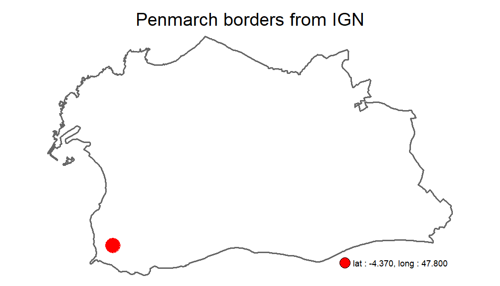

# Before starting

We can load the `happign` package, and some additional packages we will need.


```r
library(happign)
library(sf)
library(tmap)
```

# WFS and WMS service

`happign` use two data type from IGN web service :

*  WMS raster : data in raster format which are images (.jpg, .png, .tif)
*  WFS : data in shape format (.shp).

More detailed information are available [here](https://www.ogc.org/standards/wms) for WMS and [here](https://www.ogc.org/standards/wfs) for WFS.

To download data you need :

* API key corresponding to the layer you want ;
* The layer's name ;
* A shape read by [`sf`]( https://CRAN.R-project.org/package=sf) package

## API keys

API keys can be directly retrieved on the [IGN website in the expert web services](https://geoservices.ign.fr/services-web-experts) (I recommend you at this point to go and have a look) or with `get_apikeys()` function.


```r
get_apikeys()
#>  [1] "administratif" "adresse"       "agriculture"   "altimetrie"   
#>  [5] "cartes"        "cartovecto"    "clc"           "economie"     
#>  [9] "environnement" "geodesie"      "lambert93"     "ocsge"        
#> [13] "ortho"         "orthohisto"    "parcellaire"   "satellite"    
#> [17] "sol"           "topographie"   "transports"
```

## Layer name

As for API key, it is possible to find the names of available layers from the expert web services of the IGN. For example, the first layer name in **WFS format** for ["Administratif" category](https://geoservices.ign.fr/services-web-experts-administratif) is *"ADMINEXPRESS-COG-CARTO.LATEST:arrondissement"*

Again, all layer's name can be accessed from R with the `get_layers_metadata()` function. This one connects directly to the IGN site which allows to have the last updated resources. It can be used for WMS and WFS :


```r
administratif_wfs <- get_layers_metadata(apikey = "administratif", data_type = "wfs")
administratif_wms <- get_layers_metadata(apikey = "administratif", data_type = "wms")
```

## Downloading the data

Now that we know how to get an API key and layer name, it only takes a few lines to get plethora of resources. For the example we will look at the beautiful town of Penmarch in France.

### WFS

First, we are going to get borders of the Penmarch. Since it's a shape object, `get_wfs()` will be used.


```r
# First retrieve create a point inside Penmarc'h
penmarch_point <- st_sfc(st_point(c(-4.370, 47.800)), crs = 4326)

# Then download borders
penmarch_borders <- get_wfs(shape = penmarch_point,
                            apikey = "administratif",
                            layer_name = "LIMITES_ADMINISTRATIVES_EXPRESS.LATEST:commune")
#> 1/1 downloaded

# Checking result
tm_shape(penmarch_borders) + # Borders of penmarch
   tm_polygons(alpha = 0, lwd = 2) +
tm_shape(penmarch_point) + # Point use to retrieve data
   tm_dots(col = "red", size = 2) +
   tm_add_legend(type = "symbol", label = "lat : -4.370, long : 47.800",
                 col = "red", size = 1) +
   tm_layout(main.title = "Penmarch borders from IGN",
             main.title.position = "center",
             legend.position = c("right", "bottom"),
             frame = FALSE)
```



It's as simple as that!
Now you have to rely on your curiosity to explore the multiple possibilities that IGN offers. For example, who has never wondered how many road junctions there are in Penmarch?

*Spoiler : there are 192 of them*


```r
dikes <- get_wfs(shape = penmarch_borders,
                 apikey = get_apikeys()[6],
                 layer_name = "BDCARTO_BDD_WLD_WGS84G:noeud_routier")
#> 1/1 downloaded

dikes <- st_intersection(penmarch_borders, dikes)
#> Warning: attribute variables are assumed to be spatially constant
#> throughout all geometries

# Checking result
tm_shape(penmarch_borders) + # Borders of penmarch
   tm_borders(lwd = 2) +
tm_shape(dikes) + # Point use to retrieve data
   tm_dots(col = "red") +
   tm_add_legend(type = "symbol", label = "Road junction", col = "red") +
   tm_layout(main.title = "Road nodes recorded by the IGN in Penmarch",
             main.title.position = "center",
             legend.position = c("right", "bottom"),
             frame = FALSE)
```


### WMS raster

For raster, the process is the same but with the function `get_wms_raster()`. There's plenty of elevation resources inside ["altimetrie" category](https://geoservices.ign.fr/services-web-experts-altimetrie). A basic one is the Digital Elevation Model (DEM or MNT in French). Borders of Penmarch are used as shape for downloading the DEM.


```r
layers_metadata <- get_layers_metadata("altimetrie", "wms")
dem_layer_name <- layers_metadata[2, 1]

mnt <- get_wms_raster(shape = penmarch_borders,
                      apikey = "altimetrie",
                      layer_name = dem_layer_name,
                      resolution = 25,
                      crs = 4326)
#> 1/1 downloading...
#> Raster is saved at :
#> D:\Personnel\Programmation\R\Packages Perso\happign\vignettes\ELEVATION_ELEVATIONGRIDCOVERAGE_25m.tif

mnt[mnt < 0] <- NA # remove negative values in case of singularity
names(mnt) <- "Elevation [m]" # Rename raster ie the title legend

tm_shape(mnt) +
   tm_raster(colorNA = NULL) +
tm_shape(penmarch_borders)+
   tm_borders(lwd = 2)+
tm_layout(main.title = "DEM of Penmarch",
          main.title.position = "center",
          legend.position = c("right", "bottom"),
          legend.bg.color = "white", legend.bg.alpha = 0.7,
          frame = FALSE)
```


__*Rq :*__

 * *Raster from `get_wms_raster()` are `SpatRaster` object from the `terra` package. To learn more about conversion between other raster type in R go [check this out](https://geocompr.github.io/post/2021/spatial-classes-conversion/).*
