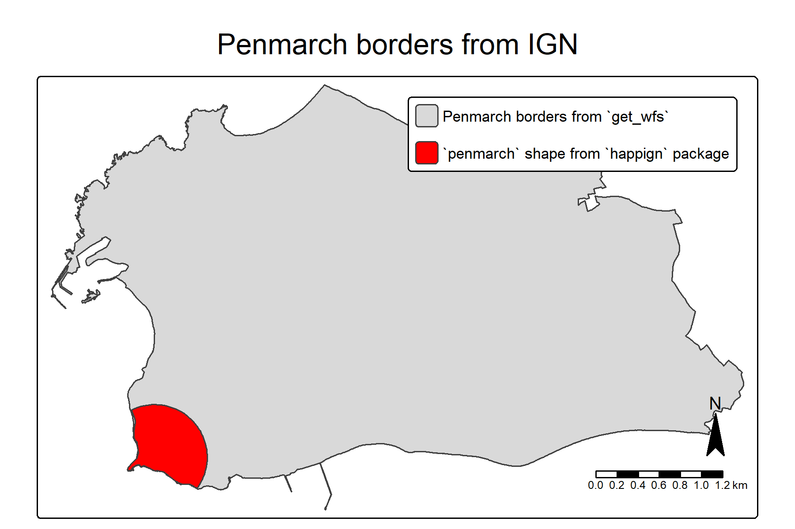
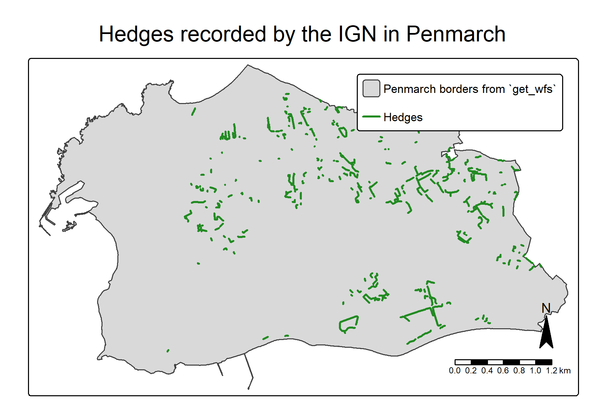

# Before starting

We can load the `happign` package, and some additional packages we will need (`sf` to manipulate spatial data and `tmap` to create maps)


``` r
knitr::opts_chunk$set(warning = FALSE, message = FALSE)
library(happign)
#> Error in library(happign): aucun package nommé 'happign' n'est trouvé
library(sf)
#> Linking to GEOS 3.13.1, GDAL 3.11.0, PROJ 9.6.0; sf_use_s2() is TRUE
library(tmap)
```


# WFS, WMS and WMTS service

`happign` use three web service from IGN :

*  WMS raster : data in raster format e.g. images (.jpg, .png, .tif, ...)
*  WMTS : same as WMS raster but images are precalculated
*  WFS : data in vector format (.shp, ...).

More detailed information are available [here](https://www.ogc.org/standards/wms/) for WMS, [here](https://www.ogc.org/standards/wmts/) for WMTS and [here](https://www.ogc.org/standards/wfs/) for WFS.

To download data from IGN web services at least two elements are needed :

* A layer name ;
* An input shape read by [`sf`]( https://CRAN.R-project.org/package=sf) package.

## Layer name

It is possible to find the names of available layers from the IGN website. For example, the first layer name in **WFS format** for ["Administratif" category](https://geoservices.ign.fr/services-web-experts-administratif) is *"ADMINEXPRESS-COG-CARTO.LATEST:arrondissement"*

All layer's name can be accessed from R with the `get_layers_metadata()` function. This one connects directly to the IGN site which allows to have the last updated resources. It can be used for WMS and WFS :


``` r
administratif_wfs <- get_layers_metadata(data_type = "wfs")
#> Error in get_layers_metadata(data_type = "wfs"): impossible de trouver la fonction "get_layers_metadata"
administratif_wms <- get_layers_metadata(data_type = "wms-r")
#> Error in get_layers_metadata(data_type = "wms-r"): impossible de trouver la fonction "get_layers_metadata"
administratif_wms <- get_layers_metadata(data_type = "wmts")
#> Error in get_layers_metadata(data_type = "wmts"): impossible de trouver la fonction "get_layers_metadata"

head(administratif_wfs)
#>                                                              Name
#> 1                     OCS-GERS_BDD_LAMB93_2016:oscge_gers_32_2016
#> 2                     OCS-GERS_BDD_LAMB93_2019:oscge_gers_32_2019
#> 3                                          IGNF_GEODESIE:site-rbf
#> 4                                          IGNF_GEODESIE:site-rdf
#> 5           LIMITES_ADMINISTRATIVES_EXPRESS.LATEST:arrondissement
#> 6 LIMITES_ADMINISTRATIVES_EXPRESS.LATEST:arrondissement_municipal
#>                                                              Title
#> 1                                                  OCSGE Gers 2016
#> 2                                                 OCSGE Gers 2019 
#> 3                                              (obsolete) Site RBF
#> 4                                              (obsolete) Site RDF
#> 5           ADMIN EXPRESS mises a jour en continu - arrondissement
#> 6 ADMIN EXPRESS mises a jour en continu - arrondissement municipal
#>                                                           Abstract
#> 1                                                  OCSGE Gers 2016
#> 2                                                 OCSGE Gers 2019 
#> 3                                                              RBF
#> 4                                                              RDF
#> 5           ADMIN EXPRESS mises a jour en continu - arrondissement
#> 6 ADMIN EXPRESS mises a jour en continu - arrondissement municipal
```

You can specify an apikey to focus on specific category. API keys can be directly retrieved on the [IGN website from the expert web services](https://geoservices.ign.fr/services-web-experts) or with `get_apikeys()` function.


``` r
get_apikeys()
#> Error in get_apikeys(): impossible de trouver la fonction "get_apikeys"

administratif_wmts <- get_layers_metadata("wmts", "administratif")
#> Error in get_layers_metadata("wmts", "administratif"): impossible de trouver la fonction "get_layers_metadata"

head(administratif_wmts)
#>                                     Title
#> 1                  ADMINEXPRESS COG CARTO
#> 2 ADMINEXPRESS COG ; Edition : 2017-01-01
#> 3 ADMINEXPRESS COG ; Edition : 2018-01-01
#> 4 ADMINEXPRESS COG ; Edition : 2019-01-01
#> 5 ADMINEXPRESS COG ; Edition : 2020-01-01
#> 6 ADMINEXPRESS COG ; Edition : 2021-01-01
#>                                                                                Abstract
#> 1                Limites administratives mises à jour en continu ; Edition : 2025-01-01
#> 2 Limites administratives Express COG code officiel géographique ; Edition : 2017-01-01
#> 3 Limites administratives Express COG code officiel géographique ; Edition : 2018-01-01
#> 4 Limites administratives Express COG code officiel géographique ; Edition : 2019-01-01
#> 5 Limites administratives Express COG code officiel géographique ; Edition : 2020-01-01
#> 6 Limites administratives Express COG code officiel géographique ; Edition : 2021-01-01
#>                      Identifier
#> 1 ADMINEXPRESS-COG-CARTO.LATEST
#> 2         ADMINEXPRESS-COG.2017
#> 3         ADMINEXPRESS-COG.2018
#> 4         ADMINEXPRESS-COG.2019
#> 5         ADMINEXPRESS-COG.2020
#> 6         ADMINEXPRESS-COG.2021
```

## Downloading the data

Now that we know how to get a layer name, it only takes a few lines to get plethora of resources. For the example we will look at the beautiful town of Penmarch in France. A part of this town is stored as a shape in happign.


``` r
penmarch <- read_sf(system.file("extdata/penmarch.shp", package = "happign"))
#> Error: `dsn` must point to a source, not an empty string.
```

### WFS

`get_wfs` can be used to download borders :


``` r
penmarch_borders <- get_wfs(x = penmarch,
                            layer = "LIMITES_ADMINISTRATIVES_EXPRESS.LATEST:commune")
#> Error in get_wfs(x = penmarch, layer = "LIMITES_ADMINISTRATIVES_EXPRESS.LATEST:commune"): impossible de trouver la fonction "get_wfs"
# Checking result
tm_shape(penmarch_borders) +
   tm_polygons() +
   tm_add_legend(type = "polygons", position = c("right", "top"),
                 labels = "Penmarch borders from `get_wfs`")+
tm_shape(penmarch) +
   tm_polygons(fill="red") +
   tm_add_legend(type = "polygons", fill="red", position = c("right", "top"),
                 labels = "`penmarch` shape from `happign` package")+
tm_title("Penmarch borders from IGN",
         position = tm_pos_out("center", "top", pos.h = "center"))+
   tm_compass(type = "arrow")+
   tm_scalebar()
```

<div class="figure" style="text-align: center">

<p class="caption">plot of chunk get_wfs</p>
</div>

It's as simple as that!
Now you have to rely on your curiosity to explore the multiple possibilities that IGN offers. For example, who has never wondered how many hedges for biodiversity there are in Penmarch?

*Spoiler : there are 434 of them !*


``` r
hedges <- get_wfs(x = penmarch_borders,
                 layer = "BDTOPO_V3:haie",
                 spatial_filter = "intersects")
#> Error in get_wfs(x = penmarch_borders, layer = "BDTOPO_V3:haie", spatial_filter = "intersects"): impossible de trouver la fonction "get_wfs"

# Checking result
tm_shape(penmarch_borders) +
   tm_polygons() +
   tm_add_legend(type = "polygons", position = c("right", "top"),
                 labels = "Penmarch borders from `get_wfs`")+
tm_shape(hedges) + # Point use to retrieve data
   tm_lines(col = "forestgreen", lwd = 2) +
   tm_add_legend(type = "lines", lwd = 2, col = "forestgreen",
                 position = c("right", "top"), labels = "Hedges")+
tm_title("Hedges recorded by the IGN in Penmarch", position = tm_pos_out("center", "top", pos.h = "center"))+
tm_compass(type = "arrow")+
tm_scalebar()
```

<div class="figure" style="text-align: center">

<p class="caption">plot of chunk get_wfs2</p>
</div>

### WMS raster

For raster, the process is the same, but with the function `get_wms_raster()`. However, you also need to specify the resolution (note that it must be in the same coordinate system as the crs parameter). There's plenty of elevation resources inside ["altimetrie" category](https://geoservices.ign.fr/services-web-experts-altimetrie). A basic one is the Digital Elevation Model (DEM or MNT in French). Borders of Penmarch are used to download the DEM. Note that for DEM, we don't want an RGB image but values of each pixels. That why `rgb=FALSE` is used below.


``` r
layers_metadata <- get_layers_metadata("wms-r", "altimetrie")
#> Error in get_layers_metadata("wms-r", "altimetrie"): impossible de trouver la fonction "get_layers_metadata"
dem_layer <- layers_metadata[3, 1] #ELEVATION.ELEVATIONGRIDCOVERAGE.HIGHRES

mnt <- get_wms_raster(x = st_buffer(penmarch_borders, 800),
                      layer = dem_layer,
                      res = 5,
                      crs = 2154,
                      rgb = FALSE)
#> Error in get_wms_raster(x = st_buffer(penmarch_borders, 800), layer = dem_layer, : impossible de trouver la fonction "get_wms_raster"

mnt[mnt < 0] <- NA # remove negative values in case of singularity
#> Error in (function (cond) : erreur d'�valuation de l'argument 'i' lors de la s�lection d'une m�thode pour la fonction '[<-' : external pointer is not valid

tm_shape(mnt) +
   tm_raster(
      col.scale = tm_scale_continuous(values = "terrain", value.na = "grey"),
      col.legend = tm_legend(title = "Height", orientation = "landscape"))+
tm_shape(penmarch_borders, is.main = TRUE)+
   tm_borders(lwd = 2)+
tm_title("Digital Elevation Model of Penmarch", position = tm_pos_out("center", "top", pos.h = "center"))+
tm_compass(type = "arrow")+
tm_scalebar()
#> Error in .Call(structure(list(name = "CppField__get", address = <pointer: (nil)>, : Valeur NULL passée comme adresse symbolique
```

__*Rq :*__

 * *Raster from `get_wms_raster()` are `SpatRaster` object from the `terra` package. To learn more about conversion between other raster type in R go [check this out](https://geocompx.org/post/2021/spatial-classes-conversion/).*

### WMTS

For WMTS, no resolution is needed because images are precalculated but a zoom level is needed. The higher the zoom level is, the more precis image is. If you only need visualisation, i recommend to use WMTS instead of WMS.


``` r
layers_metadata <- get_layers_metadata("wmts", "ortho")
#> Error in get_layers_metadata("wmts", "ortho"): impossible de trouver la fonction "get_layers_metadata"
ortho_layer <- layers_metadata[1, 3] #HR.ORTHOIMAGERY.ORTHOPHOTOS

hr_ortho <- get_wmts(x = penmarch_borders,
                     layer = ortho_layer,
                     zoom = 9)
#> Error in get_wmts(x = penmarch_borders, layer = ortho_layer, zoom = 9): impossible de trouver la fonction "get_wmts"

tm_shape(hr_ortho) +
   tm_rgb() +
tm_shape(penmarch_borders)+
   tm_borders(lwd = 2, col = "white")+
tm_title("Orthophoto Hight Resolution", position = tm_pos_out("center", "top", pos.h = "center"))+
tm_compass(type = "arrow")+
tm_scalebar()
#> Error in .Call(structure(list(name = "CppField__get", address = <pointer: (nil)>, : Valeur NULL passée comme adresse symbolique
```
