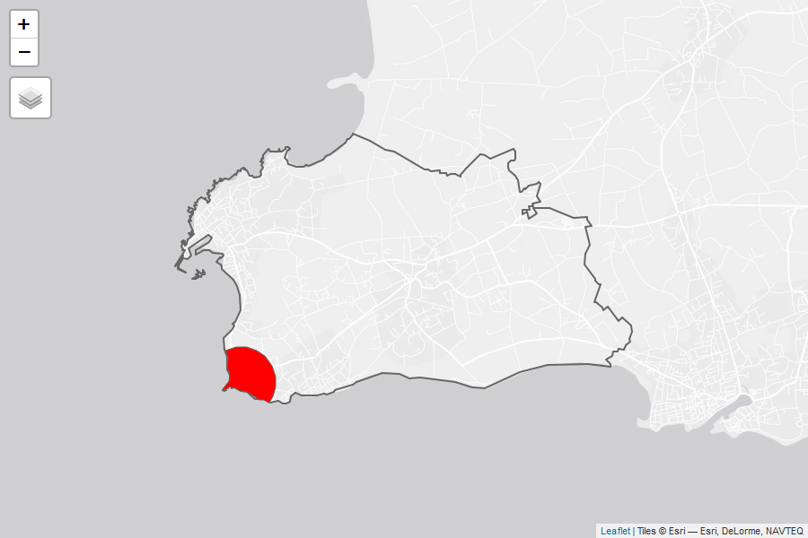
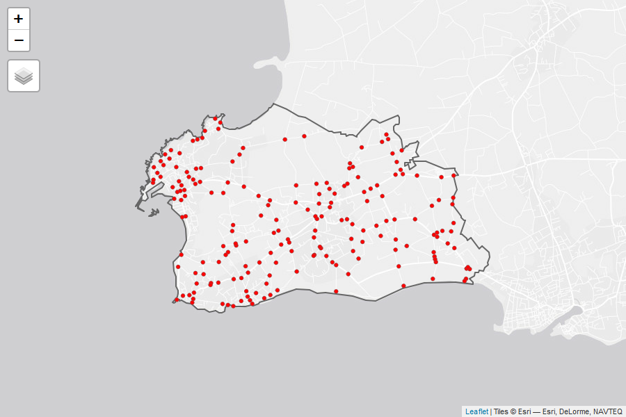
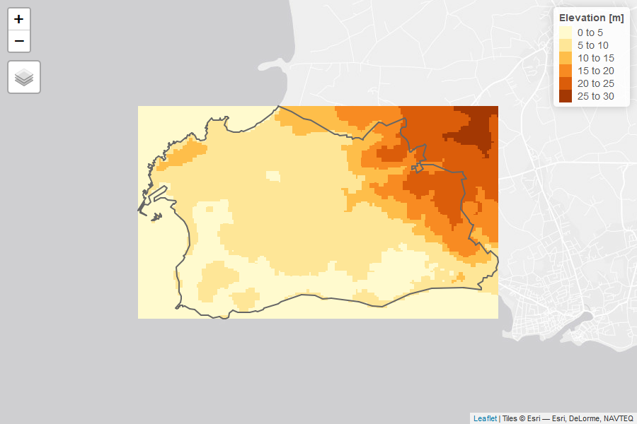

# Before starting

We can load the `happign` package, and some additional packages we will need.


```r
library(happign)
library(sf)
library(tmap)
```

# WFS and WMS service

`happign` use two web service from IGN :

*  WMS raster : data in raster format (.jpg, .png, .tif)
*  WFS : data in shape format (.shp).

More detailed information are available [here](https://www.ogc.org/standards/wms/) for WMS and [here](https://www.ogc.org/standards/wfs/) for WFS.

To download data from web services at least three elements are needed :

* An API key;
* A layer name ;
* A shape read by [`sf`]( https://CRAN.R-project.org/package=sf) package

## API key

API keys can be directly retrieved on the [IGN website in the expert web services](https://geoservices.ign.fr/services-web-experts) (I recommend you at this point to go and have a look) or with `get_apikeys()` function.


```r
get_apikeys()
#>  [1] "administratif" "adresse"       "agriculture"   "altimetrie"   
#>  [5] "cartes"        "cartovecto"    "clc"           "economie"     
#>  [9] "environnement" "geodesie"      "lambert93"     "ocsge"        
#> [13] "ortho"         "orthohisto"    "parcellaire"   "satellite"    
#> [17] "sol"           "topographie"   "transports"
```

## Layer name

As for API key, it is possible to find the names of available layers from the expert web services of the IGN. For example, the first layer name in **WFS format** for ["Administratif" category](https://geoservices.ign.fr/services-web-experts-administratif) is *"ADMINEXPRESS-COG-CARTO.LATEST:arrondissement"*

Again, all layer's name can be accessed from R with the `get_layers_metadata()` function. This one connects directly to the IGN site which allows to have the last updated resources. It can be used for WMS and WFS :


```r
administratif_wfs <- get_layers_metadata(apikey = "administratif", data_type = "wfs")
administratif_wms <- get_layers_metadata(apikey = "administratif", data_type = "wms")
```

## Downloading the data

Now that we know how to get an API key and layer name, it only takes a few lines to get plethora of resources. For the example we will look at the beautiful town of Penmarch in France. A part of this town is stored as a shape in happign.


```r
penmarch <- read_sf(system.file("extdata/penmarch.shp", package = "happign"))
```

### WFS

`get_wfs` can be used to download borders :


```r

penmarch_borders <- get_wfs(shape = penmarch,
                            apikey = "administratif",
                            layer_name = "LIMITES_ADMINISTRATIVES_EXPRESS.LATEST:commune")
#> Features downloaded : 1

# Checking result
tm_shape(penmarch_borders)+
   tm_polygons(alpha = 0, lwd = 2)+
tm_shape(penmarch)+
   tm_polygons(col = "red")+
   tm_layout(main.title = "Penmarch borders from IGN",
             main.title.position = "center")
```



It's as simple as that!
Now you have to rely on your curiosity to explore the multiple possibilities that IGN offers. For example, who has never wondered how many road junctions there are in Penmarch?

*Spoiler : there are 192 of them*


```r
dikes <- get_wfs(shape = penmarch_borders,
                 apikey = get_apikeys()[6],
                 layer_name = "BDCARTO_BDD_WLD_WGS84G:noeud_routier",
                 spatial_filter = "intersects")
#> Features downloaded : 192

# Checking result
tm_shape(penmarch_borders) + # Borders of penmarch
   tm_borders(lwd = 2) +
tm_shape(dikes) + # Point use to retrieve data
   tm_symbols(col = "red", shape = 13, size = 0.3) +
   tm_add_legend(type = "symbol", shape = 13, label = "Road junction", col = "red") +
   tm_layout(main.title = "Road nodes recorded by the IGN in Penmarch",
             main.title.position = "center",
             legend.position = c("right", "bottom"),
             frame = FALSE)
#> legend.postion is used for plot mode. Use view.legend.position in tm_view to set the legend position in view mode.
#> Symbol shapes other than circles or icons are not supported in view mode.
#> only legends of type "fill" supported in view mode
```



### WMS raster

For raster, the process is the same but with the function `get_wms_raster()`. There's plenty of elevation resources inside ["altimetrie" category](https://geoservices.ign.fr/services-web-experts-altimetrie). A basic one is the Digital Elevation Model (DEM or MNT in French). Borders of Penmarch are used as shape for downloading the DEM.


```r
layers_metadata <- get_layers_metadata("altimetrie", "wms")
dem_layer_name <- layers_metadata[2, 1] #LEVATION.ELEVATIONGRIDCOVERAGE

mnt <- get_wms_raster(shape = penmarch_borders,
                      apikey = "altimetrie",
                      layer_name = dem_layer_name,
                      resolution = 25,
                      crs = 4326)
#> although coordinates are longitude/latitude, st_intersects assumes
#> that they are planar
#> 1/1 downloading...
#> Raster is saved at :
#> D:\TMP\Rtmp69qUMl\filef904c0f33a2.tif

mnt[mnt < 0] <- NA # remove negative values in case of singularity

tm_shape(mnt) +
   tm_raster(title = "Elevation [m]") +
tm_shape(penmarch_borders)+
   tm_borders(lwd = 2)+
tm_layout(main.title = "DEM of Penmarch",
          main.title.position = "center",
          legend.position = c("right", "bottom"),
          legend.bg.color = "white", legend.bg.alpha = 0.7)
#> legend.postion is used for plot mode. Use view.legend.position in tm_view to set the legend position in view mode.
```



__*Rq :*__

 * *Raster from `get_wms_raster()` are `SpatRaster` object from the `terra` package. To learn more about conversion between other raster type in R go [check this out](https://geocompx.org/post/2021/spatial-classes-conversion/).*
