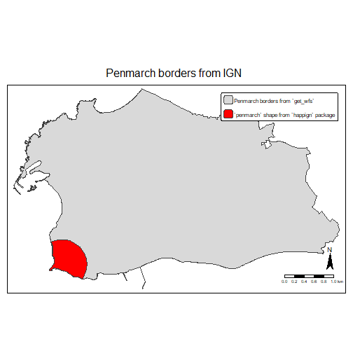
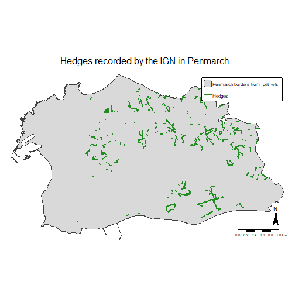
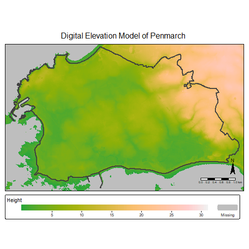

# Before starting

We can load the `happign` package, and some additional packages we will need (`sf` to manipulate spatial data and `tmap` to create maps)


``` r
library(happign)
library(sf)
#> Warning: le package 'sf' a été compilé avec
#> la version R 4.4.2
#> Linking to GEOS 3.12.2, GDAL 3.9.3, PROJ
#> 9.4.1; sf_use_s2() is TRUE
library(tmap);tmap_mode("plot")
#> Breaking News: tmap 3.x is retiring. Please test v4, e.g. with
#> remotes::install_github('r-tmap/tmap')
#> tmap mode set to plotting
```


# WFS, WMS and WMTS service

`happign` use three web service from IGN :

*  WMS raster : data in raster format e.g. images (.jpg, .png, .tif, ...)
*  WMTS : same as WMS raster but images are precalculated
*  WFS : data in vector format (.shp, ...).

More detailed information are available [here](https://www.ogc.org/publications/standard/wms/) for WMS, [here](https://www.ogc.org/publications/standard/wmts/) for WMTS and [here](https://www.ogc.org/publications/standard/wfs/) for WFS.

To download data from IGN web services at least two elements are needed :

* A layer name ;
* An input shape read by [`sf`]( https://CRAN.R-project.org/package=sf) package.

## Layer name

It is possible to find the names of available layers from the IGN website. For example, the first layer name in **WFS format** for ["Administratif" category](https://geoservices.ign.fr/services-web-experts-administratif) is *"ADMINEXPRESS-COG-CARTO.LATEST:arrondissement"*

All layer's name can be accessed from R with the `get_layers_metadata()` function. This one connects directly to the IGN site which allows to have the last updated resources. It can be used for WMS and WFS :


``` r
administratif_wfs <- get_layers_metadata(data_type = "wfs")
administratif_wms <- get_layers_metadata(data_type = "wms-r")
administratif_wms <- get_layers_metadata(data_type = "wmts")

head(administratif_wfs)
#>                                                    Name
#> 1           OCS-GERS_BDD_LAMB93_2016:oscge_gers_32_2016
#> 2           OCS-GERS_BDD_LAMB93_2019:oscge_gers_32_2019
#> 3                                      wfs_sup:acte_sup
#> 4             aeag-rwbody-sdage2022:rwbody_ag_sdage2022
#> 5 LIMITES_ADMINISTRATIVES_EXPRESS.LATEST:arrondissement
#> 6                ADMINEXPRESS-COG.LATEST:arrondissement
#>                                                Title
#> 1                                    OCSGE Gers 2016
#> 2                                   OCSGE Gers 2019 
#> 3               Acte de servitude d'utilité publique
#> 4 Adour Garonne - Masses d'eau rivières - SDAGE 2022
#> 5                                     Arrondissement
#> 6                                 Arrondissement COG
#>                                                      Abstract
#> 1                                             OCSGE Gers 2016
#> 2                                            OCSGE Gers 2019 
#> 3 Liste des actes instituant une servitude d'utilité publique
#> 4          Adour Garonne - Masses d'eau rivières - SDAGE 2022
#> 5              Limites administrative mises à jour en continu
#> 6                             Arrondissement ADMINEXPRESS COG
```

You can specify an apikey to focus on specific category. API keys can be directly retrieved on the [IGN website from the expert web services](https://geoservices.ign.fr/services-web-experts) or with `get_apikeys()` function.


``` r
get_apikeys()
#>  [1] "administratif" "adresse"      
#>  [3] "agriculture"   "altimetrie"   
#>  [5] "cartes"        "cartovecto"   
#>  [7] "clc"           "economie"     
#>  [9] "enr"           "environnement"
#> [11] "geodesie"      "lambert93"    
#> [13] "ocsge"         "ortho"        
#> [15] "orthohisto"    "parcellaire"  
#> [17] "satellite"     "sol"          
#> [19] "topographie"   "transports"

administratif_wmts <- get_layers_metadata("wmts", "administratif")

head(administratif_wmts)
#>                                              Title
#> 1                           ADMINEXPRESS COG CARTO
#> 2                                 ADMINEXPRESS COG
#> 3 Limites administratives mises à jour en continu.
#>                                                                 Abstract
#> 1 Limites administratives mises à jour en continu ; Edition : 2024-02-22
#> 2 Limites administratives mises à jour en continu ; Edition : 2024-02-22
#> 3 Limites administratives mises à jour en continu ; Edition : 2024-12-18
#>                               Identifier
#> 1          ADMINEXPRESS-COG-CARTO.LATEST
#> 2                ADMINEXPRESS-COG.LATEST
#> 3 LIMITES_ADMINISTRATIVES_EXPRESS.LATEST
```

## Downloading the data

Now that we know how to get a layer name, it only takes a few lines to get plethora of resources. For the example we will look at the beautiful town of Penmarch in France. A part of this town is stored as a shape in happign.


``` r
penmarch <- read_sf(system.file("extdata/penmarch.shp", package = "happign"))
```

### WFS

`get_wfs` can be used to download borders :


``` r

penmarch_borders <- get_wfs(x = penmarch,
                            layer = "LIMITES_ADMINISTRATIVES_EXPRESS.LATEST:commune")
#> Features downloaded : 1
# Checking result
tm_shape(penmarch_borders)+
   tm_polygons(alpha = 0, lwd = 2)+
tm_shape(penmarch)+
   tm_polygons(col = "red")+
tm_add_legend(type = "fill", border.col = "black", border.lwd =2,
              col = NA, labels = "border from get_wfs")+
tm_add_legend(type = "fill", col = "red", labels = "penmarch shape from happign package")+
tm_layout(main.title = "Penmarch borders from IGN",
          main.title.position = "center",
          legend.position = c(0.7, -0.1),
          outer.margins = c(0.1, 0,0,0),
          frame = FALSE)
```



It's as simple as that!
Now you have to rely on your curiosity to explore the multiple possibilities that IGN offers. For example, who has never wondered how many hedges for biodiversity there are in Penmarch?

*Spoiler : there are 436 of them !*


``` r
hedges <- get_wfs(x = penmarch_borders,
                 layer = "BDTOPO_V3:haie",
                 spatial_filter = "intersects")
#> Features downloaded : 434

# Checking result
tm_shape(penmarch_borders) + # Borders of penmarch
   tm_borders(lwd = 2) +
tm_shape(hedges) + # Point use to retrieve data
   tm_lines(col = "red", size = 0.3) +
   tm_add_legend(type = "line", label = "Hedges", col = "red") +
   tm_layout(main.title = "Hedges recorded by the IGN in Penmarch",
             main.title.position = "center",
             legend.position = c("right", "bottom"),
             frame = FALSE)
```



### WMS raster

For raster, the process is the same, but with the function `get_wms_raster()`, but you need to specify the resolution (note that it must be in the same coordinate system as the crs parameter). There's plenty of elevation resources inside ["altimetrie" category](https://geoservices.ign.fr/services-web-experts-altimetrie). A basic one is the Digital Elevation Model (DEM or MNT in French). Borders of Penmarch are used to download the DEM. Note that for DEM, we don't want an RGB image but values of each pixels. That why `rgb=FALSE` is used below.


``` r
layers_metadata <- get_layers_metadata("wms-r", "altimetrie")
dem_layer <- layers_metadata[2, 1] #LEVATION.ELEVATIONGRIDCOVERAGE

mnt <- get_wms_raster(x = penmarch_borders,
                      layer = dem_layer,
                      res = 25,
                      crs = 2154,
                      rgb = FALSE)
#> 0...10...20...30...40...50...60...70...80...90...100 - done.
#> Raster is saved at : C:\Users\PaulCarteron\AppData\Local\Temp\Rtmpueo2T1\file514477f61a4e.tif

mnt[mnt < 0] <- NA # remove negative values in case of singularity

tm_shape(mnt) +
   tm_raster(title = "Elevation [m]") +
tm_shape(penmarch_borders)+
   tm_borders(lwd = 2)+
tm_layout(main.title = "DEM of Penmarch",
          main.title.position = "center",
          legend.position = c("right", "bottom"),
          legend.bg.color = "white", legend.bg.alpha = 0.7)
```



__*Rq :*__

 * *Raster from `get_wms_raster()` are `SpatRaster` object from the `terra` package. To learn more about conversion between other raster type in R go [check this out](https://geocompx.org/post/2021/spatial-classes-conversion/).*

### WMTS

For WMTS, no resolution is needed because images are precalculated but a zoom level is needed. The higher the zoom level is, the more precis image is. If you only need visualisation, i recommend to use WMTS instead of WMS.


``` r
layers_metadata <- get_layers_metadata("wmts", "ortho")
ortho_layer <- layers_metadata[1, 3] #HR.ORTHOIMAGERY.ORTHOPHOTOS

hr_ortho <- get_wmts(x = penmarch_borders,
                     layer = ortho_layer,
                     zoom = 14)
#> Warning in CPL_gdalwarp(source, destination,
#> options, oo, doo, config_options, : GDAL
#> Error 1: Cannot find TileMatrix of zoom
#> level 14 in TileMatrixSet 'PM_6_19'
#> Error: Check that `layer` is valid

tm_shape(hr_ortho) +
   tm_rgb(title = "Orthophoto Hight Resolution") +
tm_shape(penmarch_borders)+
   tm_borders(lwd = 2)+
tm_layout(main.title = "Orthophoto Hight Resolution",
          main.title.position = "center",
          legend.position = c("right", "bottom"),
          legend.bg.color = "white", legend.bg.alpha = 0.7)
#> Error in eval(expr, envir, enclos): objet 'hr_ortho' introuvable
```
